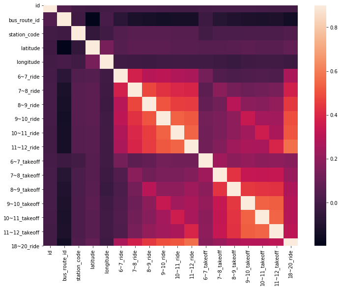

# jeju-bus-2019
machine learning

```python
import os

import pandas as pd
import numpy as np
import warnings
warnings.filterwarnings('ignore')

from collections import Counter # count 용도

import matplotlib.pyplot as plt # 시각화
import seaborn as sns #시각화

import folium # 지도 관련 시각화
from folium.plugins import MarkerCluster #지도 관련 시각화
import geopy.distance #거리 계산해주는 패키지 사용

import random #데이터 샘플링
from sklearn.model_selection import GridSearchCV #모델링
from sklearn.ensemble import RandomForestRegressor #모델링
```


```python
os.chdir("./data/")
```


```python
train = pd.read_csv("train_ansi.csv", encoding='CP949')
test = pd.read_csv("test_ansi.csv", encoding='CP949')
```


```python
#check the numbers of samples and features
print("The train data size is : {} ".format(train.shape))
print("The test data size is : {} ".format(test.shape))
```

    The train data size is : (415423, 21) 
    The test data size is : (228170, 20) 
    

* 외부데이터(기간: 2019.09.01 ~ 10.16)
* 06~11시에 해당되는 사항들만 편집


```python
#데이터 불러오기
raining=pd.read_csv("weather.csv",engine='python')

#외부데이터에서 나오는 지점명들을 변경
raining['지점'] = [ str(i) for i in raining['지점'] ]

raining['지점'] = ['jeju' if i=='184' else i for i in raining['지점'] ]  # 위도 : 33.51411 경도 : 126.52969
raining['지점'] = ['gosan' if i=='185' else i for i in raining['지점'] ]  # 위도 : 33.29382 경도 : 126.16283
raining['지점'] = ['seongsan' if i=='188' else i for i in raining['지점'] ]  # 위도 : 33.38677 경도 : 126.8802
raining['지점'] = ['po' if i=='189' else i for i in raining['지점'] ]  # 위도 : 33.24616 경도 : 126.5653

raining.head()
```


<div>


<table border="1" class="dataframe">
  <thead>
    <tr style="text-align: right;">
      <th></th>
      <th>지점</th>
      <th>일시</th>
      <th>기온(°C)</th>
      <th>강수량(mm)</th>
    </tr>
  </thead>
  <tbody>
    <tr>
      <td>0</td>
      <td>jeju</td>
      <td>2019-09-01 0:00</td>
      <td>23.7</td>
      <td>NaN</td>
    </tr>
    <tr>
      <td>1</td>
      <td>jeju</td>
      <td>2019-09-01 1:00</td>
      <td>23.7</td>
      <td>NaN</td>
    </tr>
    <tr>
      <td>2</td>
      <td>jeju</td>
      <td>2019-09-01 2:00</td>
      <td>23.5</td>
      <td>NaN</td>
    </tr>
    <tr>
      <td>3</td>
      <td>jeju</td>
      <td>2019-09-01 3:00</td>
      <td>23.4</td>
      <td>NaN</td>
    </tr>
    <tr>
      <td>4</td>
      <td>jeju</td>
      <td>2019-09-01 4:00</td>
      <td>23.4</td>
      <td>NaN</td>
    </tr>
  </tbody>
</table>
</div>


```python
# bts = pd.read_csv("./input/exdata/train_cate_onoff.csv",engine='python')
# bts.info()
```

## 2. Features engineering
### 1) target feature 분리


```python
ntrain = train.shape[0]
ntest = test.shape[0]
# y_train = train["18~20_ride"].values
y_train = train["18~20_ride"]
all_data = pd.concat((train, test)).reset_index(drop=True)
all_data.drop(['18~20_ride'], axis=1, inplace=True)
print("all_data size is : {}".format(all_data.shape))
```

    all_data size is : (643593, 20)
    

### 2) missing data 처리


```python
all_data_na = (all_data.isnull().sum() / len(all_data)) * 100
all_data_na = all_data_na.drop(all_data_na[all_data_na == 0].index).sort_values(ascending=False)[:30]
missing_data = pd.DataFrame({'Missing Ratio' :all_data_na})
missing_data.head(20)
```


#### "Do not need to imput missing value"

### 3) Data Correlation


```python
#Correlation map to see how features are correlated with 18~20_ride
corrmat = train.corr()
plt.subplots(figsize=(12,9))
sns.heatmap(corrmat, vmax=0.9, square=True)
```

</img>
   

```python
corrmat
```


<div>

<table border="1" class="dataframe">
  <thead>
    <tr style="text-align: right;">
      <th></th>
      <th>id</th>
      <th>bus_route_id</th>
      <th>station_code</th>
      <th>latitude</th>
      <th>longitude</th>
      <th>6~7_ride</th>
      <th>7~8_ride</th>
      <th>8~9_ride</th>
      <th>9~10_ride</th>
      <th>10~11_ride</th>
      <th>11~12_ride</th>
      <th>6~7_takeoff</th>
      <th>7~8_takeoff</th>
      <th>8~9_takeoff</th>
      <th>9~10_takeoff</th>
      <th>10~11_takeoff</th>
      <th>11~12_takeoff</th>
      <th>18~20_ride</th>
    </tr>
  </thead>
  <tbody>
    <tr>
      <td>id</td>
      <td>1.000000</td>
      <td>0.035830</td>
      <td>-0.002053</td>
      <td>-0.013783</td>
      <td>-0.000816</td>
      <td>0.000852</td>
      <td>0.005181</td>
      <td>0.007540</td>
      <td>0.003844</td>
      <td>-0.001189</td>
      <td>-0.002990</td>
      <td>0.002609</td>
      <td>0.004733</td>
      <td>0.008766</td>
      <td>0.005899</td>
      <td>0.002119</td>
      <td>-0.000701</td>
      <td>-0.000544</td>
    </tr>
    <tr>
      <td>bus_route_id</td>
      <td>0.035830</td>
      <td>1.000000</td>
      <td>-0.015897</td>
      <td>-0.196758</td>
      <td>0.010187</td>
      <td>-0.070173</td>
      <td>-0.119180</td>
      <td>-0.127838</td>
      <td>-0.137973</td>
      <td>-0.129171</td>
      <td>-0.129354</td>
      <td>-0.019856</td>
      <td>-0.081713</td>
      <td>-0.102422</td>
      <td>-0.114123</td>
      <td>-0.116376</td>
      <td>-0.111560</td>
      <td>-0.143702</td>
    </tr>
    <tr>
      <td>station_code</td>
      <td>-0.002053</td>
      <td>-0.015897</td>
      <td>1.000000</td>
      <td>-0.048951</td>
      <td>-0.011303</td>
      <td>0.036374</td>
      <td>0.055432</td>
      <td>0.057153</td>
      <td>0.054709</td>
      <td>0.050765</td>
      <td>0.050141</td>
      <td>-0.003185</td>
      <td>0.020918</td>
      <td>0.020559</td>
      <td>0.022664</td>
      <td>0.024277</td>
      <td>0.025059</td>
      <td>0.034360</td>
    </tr>
    <tr>
      <td>latitude</td>
      <td>-0.013783</td>
      <td>-0.196758</td>
      <td>-0.048951</td>
      <td>1.000000</td>
      <td>0.134208</td>
      <td>0.045578</td>
      <td>0.067125</td>
      <td>0.066391</td>
      <td>0.065680</td>
      <td>0.059462</td>
      <td>0.059777</td>
      <td>0.050534</td>
      <td>0.047558</td>
      <td>0.055750</td>
      <td>0.067264</td>
      <td>0.058728</td>
      <td>0.057602</td>
      <td>0.079261</td>
    </tr>
    <tr>
      <td>longitude</td>
      <td>-0.000816</td>
      <td>0.010187</td>
      <td>-0.011303</td>
      <td>0.134208</td>
      <td>1.000000</td>
      <td>-0.009556</td>
      <td>-0.015767</td>
      <td>-0.019433</td>
      <td>-0.008536</td>
      <td>-0.007532</td>
      <td>-0.008551</td>
      <td>-0.010856</td>
      <td>-0.021163</td>
      <td>-0.030240</td>
      <td>-0.013897</td>
      <td>-0.007629</td>
      <td>-0.005170</td>
      <td>-0.021368</td>
    </tr>
    <tr>
      <td>6~7_ride</td>
      <td>0.000852</td>
      <td>-0.070173</td>
      <td>0.036374</td>
      <td>0.045578</td>
      <td>-0.009556</td>
      <td>1.000000</td>
      <td>0.375844</td>
      <td>0.296554</td>
      <td>0.313622</td>
      <td>0.279269</td>
      <td>0.265106</td>
      <td>0.131812</td>
      <td>0.031980</td>
      <td>0.019047</td>
      <td>0.029102</td>
      <td>0.030359</td>
      <td>0.029797</td>
      <td>0.262173</td>
    </tr>
    <tr>
      <td>7~8_ride</td>
      <td>0.005181</td>
      <td>-0.119180</td>
      <td>0.055432</td>
      <td>0.067125</td>
      <td>-0.015767</td>
      <td>0.375844</td>
      <td>1.000000</td>
      <td>0.479535</td>
      <td>0.427030</td>
      <td>0.395135</td>
      <td>0.389945</td>
      <td>0.068717</td>
      <td>0.184060</td>
      <td>0.129881</td>
      <td>0.106197</td>
      <td>0.117298</td>
      <td>0.135832</td>
      <td>0.371751</td>
    </tr>
    <tr>
      <td>8~9_ride</td>
      <td>0.007540</td>
      <td>-0.127838</td>
      <td>0.057153</td>
      <td>0.066391</td>
      <td>-0.019433</td>
      <td>0.296554</td>
      <td>0.479535</td>
      <td>1.000000</td>
      <td>0.506296</td>
      <td>0.458034</td>
      <td>0.453017</td>
      <td>0.085007</td>
      <td>0.122234</td>
      <td>0.303641</td>
      <td>0.192257</td>
      <td>0.175396</td>
      <td>0.206125</td>
      <td>0.445316</td>
    </tr>
    <tr>
      <td>9~10_ride</td>
      <td>0.003844</td>
      <td>-0.137973</td>
      <td>0.054709</td>
      <td>0.065680</td>
      <td>-0.008536</td>
      <td>0.313622</td>
      <td>0.427030</td>
      <td>0.506296</td>
      <td>1.000000</td>
      <td>0.537374</td>
      <td>0.517800</td>
      <td>0.126445</td>
      <td>0.144562</td>
      <td>0.194736</td>
      <td>0.339456</td>
      <td>0.246237</td>
      <td>0.241739</td>
      <td>0.494085</td>
    </tr>
    <tr>
      <td>10~11_ride</td>
      <td>-0.001189</td>
      <td>-0.129171</td>
      <td>0.050765</td>
      <td>0.059462</td>
      <td>-0.007532</td>
      <td>0.279269</td>
      <td>0.395135</td>
      <td>0.458034</td>
      <td>0.537374</td>
      <td>1.000000</td>
      <td>0.542494</td>
      <td>0.117809</td>
      <td>0.144040</td>
      <td>0.196125</td>
      <td>0.241713</td>
      <td>0.359848</td>
      <td>0.268409</td>
      <td>0.512666</td>
    </tr>
    <tr>
      <td>11~12_ride</td>
      <td>-0.002990</td>
      <td>-0.129354</td>
      <td>0.050141</td>
      <td>0.059777</td>
      <td>-0.008551</td>
      <td>0.265106</td>
      <td>0.389945</td>
      <td>0.453017</td>
      <td>0.517800</td>
      <td>0.542494</td>
      <td>1.000000</td>
      <td>0.121649</td>
      <td>0.165455</td>
      <td>0.233460</td>
      <td>0.266315</td>
      <td>0.259136</td>
      <td>0.394024</td>
      <td>0.569747</td>
    </tr>
    <tr>
      <td>6~7_takeoff</td>
      <td>0.002609</td>
      <td>-0.019856</td>
      <td>-0.003185</td>
      <td>0.050534</td>
      <td>-0.010856</td>
      <td>0.131812</td>
      <td>0.068717</td>
      <td>0.085007</td>
      <td>0.126445</td>
      <td>0.117809</td>
      <td>0.121649</td>
      <td>1.000000</td>
      <td>0.233302</td>
      <td>0.189507</td>
      <td>0.212331</td>
      <td>0.184720</td>
      <td>0.194141</td>
      <td>0.178353</td>
    </tr>
    <tr>
      <td>7~8_takeoff</td>
      <td>0.004733</td>
      <td>-0.081713</td>
      <td>0.020918</td>
      <td>0.047558</td>
      <td>-0.021163</td>
      <td>0.031980</td>
      <td>0.184060</td>
      <td>0.122234</td>
      <td>0.144562</td>
      <td>0.144040</td>
      <td>0.165455</td>
      <td>0.233302</td>
      <td>1.000000</td>
      <td>0.429626</td>
      <td>0.338220</td>
      <td>0.326165</td>
      <td>0.334719</td>
      <td>0.219430</td>
    </tr>
    <tr>
      <td>8~9_takeoff</td>
      <td>0.008766</td>
      <td>-0.102422</td>
      <td>0.020559</td>
      <td>0.055750</td>
      <td>-0.030240</td>
      <td>0.019047</td>
      <td>0.129881</td>
      <td>0.303641</td>
      <td>0.194736</td>
      <td>0.196125</td>
      <td>0.233460</td>
      <td>0.189507</td>
      <td>0.429626</td>
      <td>1.000000</td>
      <td>0.443466</td>
      <td>0.429163</td>
      <td>0.425298</td>
      <td>0.274360</td>
    </tr>
    <tr>
      <td>9~10_takeoff</td>
      <td>0.005899</td>
      <td>-0.114123</td>
      <td>0.022664</td>
      <td>0.067264</td>
      <td>-0.013897</td>
      <td>0.029102</td>
      <td>0.106197</td>
      <td>0.192257</td>
      <td>0.339456</td>
      <td>0.241713</td>
      <td>0.266315</td>
      <td>0.212331</td>
      <td>0.338220</td>
      <td>0.443466</td>
      <td>1.000000</td>
      <td>0.539305</td>
      <td>0.531232</td>
      <td>0.295875</td>
    </tr>
    <tr>
      <td>10~11_takeoff</td>
      <td>0.002119</td>
      <td>-0.116376</td>
      <td>0.024277</td>
      <td>0.058728</td>
      <td>-0.007629</td>
      <td>0.030359</td>
      <td>0.117298</td>
      <td>0.175396</td>
      <td>0.246237</td>
      <td>0.359848</td>
      <td>0.259136</td>
      <td>0.184720</td>
      <td>0.326165</td>
      <td>0.429163</td>
      <td>0.539305</td>
      <td>1.000000</td>
      <td>0.540594</td>
      <td>0.290691</td>
    </tr>
    <tr>
      <td>11~12_takeoff</td>
      <td>-0.000701</td>
      <td>-0.111560</td>
      <td>0.025059</td>
      <td>0.057602</td>
      <td>-0.005170</td>
      <td>0.029797</td>
      <td>0.135832</td>
      <td>0.206125</td>
      <td>0.241739</td>
      <td>0.268409</td>
      <td>0.394024</td>
      <td>0.194141</td>
      <td>0.334719</td>
      <td>0.425298</td>
      <td>0.531232</td>
      <td>0.540594</td>
      <td>1.000000</td>
      <td>0.313540</td>
    </tr>
    <tr>
      <td>18~20_ride</td>
      <td>-0.000544</td>
      <td>-0.143702</td>
      <td>0.034360</td>
      <td>0.079261</td>
      <td>-0.021368</td>
      <td>0.262173</td>
      <td>0.371751</td>
      <td>0.445316</td>
      <td>0.494085</td>
      <td>0.512666</td>
      <td>0.569747</td>
      <td>0.178353</td>
      <td>0.219430</td>
      <td>0.274360</td>
      <td>0.295875</td>
      <td>0.290691</td>
      <td>0.313540</td>
      <td>1.000000</td>
    </tr>
  </tbody>
</table>
</div>


### 4) Data Columns Classification


```python
# all_data.index
```


```python
# all_data.index.dtype
```


```python
# all_data.index.astype(np.float64, copy=False)
```


```python
# all_data.index.dtype
```


```python
all_data.info()
```

    <class 'pandas.core.frame.DataFrame'>
    RangeIndex: 643593 entries, 0 to 643592
    Data columns (total 20 columns):
    10~11_ride       643593 non-null int64
    10~11_takeoff    643593 non-null int64
    11~12_ride       643593 non-null int64
    11~12_takeoff    643593 non-null int64
    6~7_ride         643593 non-null int64
    6~7_takeoff      643593 non-null int64
    7~8_ride         643593 non-null int64
    7~8_takeoff      643593 non-null int64
    8~9_ride         643593 non-null int64
    8~9_takeoff      643593 non-null int64
    9~10_ride        643593 non-null int64
    9~10_takeoff     643593 non-null int64
    bus_route_id     643593 non-null int64
    date             643593 non-null object
    id               643593 non-null int64
    in_out           643593 non-null object
    latitude         643593 non-null float64
    longitude        643593 non-null float64
    station_code     643593 non-null int64
    station_name     643593 non-null object
    dtypes: float64(2), int64(15), object(3)
    memory usage: 98.2+ MB
    


```python
cate_feature = [col for col in all_data.columns if all_data[col].dtypes=="object"]
cate_feature=list(set(cate_feature))
num_feature = list(set(all_data.columns)-set(cate_feature))
```


```python
# cate_feature
```


```python
# num_feature
```


```python
# for i in cate_feature:
#     vals = set(all_data[i].values)
#     cnt = all_data[i].value_counts().sort_index(ascending=True)
#     print(i, "\n", cnt, "\n""\n")
# #     val_map = map({'cate_feature':i,'val':vals, 'val_cnt':len(vals)})
```

### 4)-A. categorical 변수

#### A-1. date 변수 변환


```python
all_data['date'] = pd.to_datetime(all_data['date'])
```


```python
all_data['weekday'] = all_data['date'].dt.weekday
# Monday is 0 and Sunday is 6.
```


```python
all_data = pd.get_dummies(all_data, columns=['weekday'])
```

#### A-2. in_out 변수 변환


```python
# all_data['in_out'].value_counts()
```


```python
all_data['in_out'] = all_data['in_out'].map({'시내':0,'시외':1})
```

### 4)-B. numeric 변수

#### B-1. 승차, 하차시간: 승차, 하차 시간대 통합 작업


```python
all_data['68_ride']=all_data['6~7_ride']+all_data['7~8_ride'] # 6 ~ 8시 승차인원
all_data['810_ride']=all_data['8~9_ride']+all_data['9~10_ride']
all_data['1012_ride']=all_data['10~11_ride']+all_data['11~12_ride']

all_data['68_takeoff']=all_data['6~7_takeoff']+all_data['7~8_takeoff'] # 6 ~ 8시 하차인원
all_data['810_takeoff']=all_data['8~9_takeoff']+all_data['9~10_takeoff']
all_data['1012_takeoff']=all_data['10~11_takeoff']+all_data['11~12_takeoff']

all_data['ride']=all_data['68_ride']+all_data['810_ride']+all_data['1012_ride']
all_data['takeoff']=all_data['68_takeoff']+all_data['810_takeoff']+all_data['1012_takeoff']
```


```python
# train22=all_data[['6~7_ride', '7~8_ride', "8~9_ride", '9~10_ride', '10~11_ride', '11~12_ride', '68ride', "810_ride", "1012_ride"]]
# train22["ride"]=y_train

# cor=train22.corr()
```


```python
# cor
```


```python
# all_data.columns
```

* 차트로 target feature와의 상관관계 확인용 train 분리


```python
# train = all_data[:ntrain] #ntrain = train.shape[0]
# # test = all_data[ntrain:]
```


```python
# train22=train[['ride', 'takeoff']]
# train22["18~20_ride"]=y_train

# cor=train22.corr()
# # sns.set(style="white")
# # mask=np.zeros_like(cor,dtype=np.bool)
# # mask[np.triu_indices_from(mask)]=True

# # f,ax=plt.subplots(figsize=(20,15))
# # cmap=sns.diverging_palette(200,10,as_cmap=True)
# # sns.heatmap(cor, mask=mask,cmap=cmap,center=0,square=True,linewidths=0.5,cbar_kws={"shrink":1},annot=True); #히트맵 생성
# # plt.xticks(size=20)
# # plt.yticks(size=20,rotation=0)
# # plt.title("arrive and leave correlation graph",size=30);
```


```python
# cor
```

* 동일한 혹은 더 높은 상관관계 실현


```python
drop_columns1 = ['6~7_ride', '7~8_ride', '8~9_ride', '9~10_ride', '10~11_ride', '11~12_ride']
drop_columns2 = ['6~7_takeoff', '7~8_takeoff', '8~9_takeoff', '9~10_takeoff', '10~11_takeoff', '11~12_takeoff']
all_data.drop(drop_columns1, axis=1, inplace=True)
all_data.drop(drop_columns2, axis=1, inplace=True)
all_data.columns
```


    Index(['bus_route_id', 'date', 'id', 'in_out', 'latitude', 'longitude',
           'station_code', 'station_name', 'weekday_0', 'weekday_1', 'weekday_2',
           'weekday_3', 'weekday_4', 'weekday_5', 'weekday_6', '68_ride',
           '810_ride', '1012_ride', '68_takeoff', '810_takeoff', '1012_takeoff',
           'ride', 'takeoff'],
          dtype='object')


#### C-1. 좌표 데이터
- 제주도의 인구는 서귀포시와 제주시에 밀집
- 해당 지역 및 서쪽 동쪽 지역의 위치 활용, 해당 지역과의 거리를 각각 feature로 추가

* 제주 측정소의 위.경도: 33.51411, 126.52969
* 고산 측정소의 위.경도: 33.29382, 126.16283
* 성산 측정소의 위.경도: 33.38677, 126.880
* 서귀포 측정소의 위.경도: 33.24616, 126.5653


```python
# 해당 주요 장소의 임의 지역 위도, 경도

jeju=(33.51411, 126.52969) # 제주 측정소 근처
gosan=(33.29382, 126.16283) #고산 측정소 근처
seongsan=(33.38677, 126.8802) #성산 측정소 근처
po=(33.24616, 126.5653) #서귀포 측정소 근처
uni=(33.458564, 126.561722) #제주대학교 

#제주도 지역이 보일 수 있는 위치의 위도, 경도를 표시한 뒤, folium.Map에 변수로 넣고, map_osm에 할당
map_osm= folium.Map((33.399835, 126.506031),zoom_start=9)
mc = MarkerCluster()

mc.add_child( folium.Marker(location=jeju,popup='제주 측정소',icon=folium.Icon(color='red',icon='info-sign') ) ) #제주 측정소 마커 생성
map_osm.add_child(mc) #마커를 map_osm에 추가

mc.add_child( folium.Marker(location=gosan,popup='고산 측정소',icon=folium.Icon(color='red',icon='info-sign') ) )
map_osm.add_child(mc) 

mc.add_child( folium.Marker(location=seongsan,popup='성산 측정소',icon=folium.Icon(color='red',icon='info-sign') ) )
map_osm.add_child(mc) 

mc.add_child( folium.Marker(location=po,popup='서귀포 측정소',icon=folium.Icon(color='red',icon='info-sign') ) )
map_osm.add_child(mc)

mc.add_child( folium.Marker(location=uni,popup='제주대 측정소',icon=folium.Icon(color='red',icon='info-sign') ) )
map_osm.add_child(mc)
```


```python
# #정류장의 위치만 확인하기 위해 groupby를 실행함
# data=all_data[['latitude','longitude','station_name']].drop_duplicates(keep='first')

# data2=data.groupby(['station_name'])['latitude','longitude'].mean()

# data2.to_csv("folium.csv")

# data2=pd.read_csv("folium.csv")

# #정류장의 대략적인 위치를 확인하기 위하여, folium map에 해당 정류장을 표시
# for row in data2.itertuples():
#     mc.add_child(folium.Marker(location=[row.latitude,  row.longitude], popup=row.station_name)) #마커 생성
#     map_osm.add_child(mc) #마커를 map_osm에 추가
    
# map_osm
```

#### C-2. 측정소와 정류장 사이 거리 계산 적용

geopy.distance.vincenty를 이용, m/km 단위 계산 (현재 km 단위 사용)
* dis_jeju : 버스정류장과 제주 측정소와의 거리
* dis_gosan : 버스정류장과 고산 측정소시와의 거리
* dis_seongsan : 버스정류장과 성산 측정소와의 거리
* dis_po : 버스정류장과 서귀포 측정소와의 거리


```python
t1 = [geopy.distance.vincenty( (i,j), jeju).km for i,j in list( zip( all_data['latitude'],all_data['longitude'] )) ]
t2 = [geopy.distance.vincenty( (i,j), gosan).km for i,j in list( zip( all_data['latitude'],all_data['longitude'] )) ]
t3 = [geopy.distance.vincenty( (i,j), seongsan).km for i,j in list( zip( all_data['latitude'],all_data['longitude'] )) ]
t4 = [geopy.distance.vincenty( (i,j), po).km for i,j in list( zip( all_data['latitude'],all_data['longitude'] )) ]
t5 = [geopy.distance.vincenty( (i,j), uni).km for i,j in list( zip( all_data['latitude'],all_data['longitude'] )) ]

all_data['dis_jeju']=t1
all_data['dis_gosan']=t2
all_data['dis_seongsan']=t3
all_data['dis_po']=t4
all_data['dis_uni']=t5
```


```python
total=pd.DataFrame( list(zip( t1,t2,t3,t4,t5)),columns=['jeju','gosan','seongsan','po','jeju'] )
total
```


<div>

<table border="1" class="dataframe">
  <thead>
    <tr style="text-align: right;">
      <th></th>
      <th>jeju</th>
      <th>gosan</th>
      <th>seongsan</th>
      <th>po</th>
      <th>jeju</th>
    </tr>
  </thead>
  <tbody>
    <tr>
      <td>0</td>
      <td>4.286659</td>
      <td>37.692766</td>
      <td>37.713630</td>
      <td>27.841879</td>
      <td>7.212504</td>
    </tr>
    <tr>
      <td>1</td>
      <td>4.966848</td>
      <td>37.008492</td>
      <td>38.465822</td>
      <td>27.996179</td>
      <td>7.904267</td>
    </tr>
    <tr>
      <td>2</td>
      <td>6.330746</td>
      <td>35.642126</td>
      <td>39.259820</td>
      <td>27.496551</td>
      <td>8.594605</td>
    </tr>
    <tr>
      <td>3</td>
      <td>3.575272</td>
      <td>38.643401</td>
      <td>38.386802</td>
      <td>29.579404</td>
      <td>8.293403</td>
    </tr>
    <tr>
      <td>4</td>
      <td>30.652098</td>
      <td>23.648361</td>
      <td>45.899140</td>
      <td>14.269792</td>
      <td>26.427880</td>
    </tr>
    <tr>
      <td>...</td>
      <td>...</td>
      <td>...</td>
      <td>...</td>
      <td>...</td>
      <td>...</td>
    </tr>
    <tr>
      <td>643588</td>
      <td>40.193817</td>
      <td>1.810388</td>
      <td>65.835199</td>
      <td>36.362254</td>
      <td>39.562301</td>
    </tr>
    <tr>
      <td>643589</td>
      <td>19.020368</td>
      <td>24.608845</td>
      <td>51.446906</td>
      <td>32.217732</td>
      <td>21.131182</td>
    </tr>
    <tr>
      <td>643590</td>
      <td>27.117280</td>
      <td>16.319339</td>
      <td>57.465292</td>
      <td>33.738981</td>
      <td>28.174441</td>
    </tr>
    <tr>
      <td>643591</td>
      <td>2.134693</td>
      <td>39.904297</td>
      <td>36.202951</td>
      <td>28.484278</td>
      <td>6.293030</td>
    </tr>
    <tr>
      <td>643592</td>
      <td>29.502808</td>
      <td>32.543755</td>
      <td>37.889853</td>
      <td>5.348404</td>
      <td>23.804169</td>
    </tr>
  </tbody>
</table>
<p>643593 rows × 5 columns</p>
</div>


- 변수 생성(dist_name): 해당 정류소에서 가장 가까운 측정소(jeju, gosan, seongsan, po)


```python
all_data['dist_name'] = total.apply(lambda x: x.argmin(), axis=1)

data22=all_data[['station_name','latitude','longitude','dist_name']].drop_duplicates(keep='first')

# 전체 정류장별 어느 측정소와 가장 가까운지 Counter를 통해 확인
Counter(data22['dist_name'])
```


    Counter({'jeju': 1518, 'po': 829, 'gosan': 665, 'seongsan': 589})


### 5) 외부데이터 활용
#### 5)-A. 외부 날씨 측정 데이터
* 일시와 시간대를 분리


```python
raining['time'] = [ int( i.split(' ')[1].split(':')[0] ) for i in raining['일시']] 
raining['일시'] = [ i.split(' ')[0] for i in raining['일시'] ] 

# 실제 측정 데이터이기 때문에, 12시 이전의 시간대만 사용
raining = raining[ (raining['time']>=6) & (raining['time']<12)  ]
```


```python
# raining
```

#### A-1. (Feature Engineering) 새로운 변수 생성: 해당 시간대 평균 기온 및 강수량(groupby)


```python
rain = raining.groupby(['지점','일시'])[['기온(°C)','강수량(mm)']].mean()

rain.to_csv("rain.csv")

rain=pd.read_csv("rain.csv")
```

* 변수명 동일하게 변경, 결측 처리 (NaN == 0.0000)


```python
# train, test의 변수명과 통일시키고, NaN의 값은 0.0000으로 변경
rain = rain.rename(columns={"일시":"date","지점":"dist_name"})
rain= rain.fillna(0.00000)
```

* all_data에 merge


```python
# all_data.info()
```


```python
# rain.info()
```


```python
rain['date'] = pd.to_datetime(rain['date'])
```


```python
all_data=pd.merge(all_data, rain, how='left',on=['dist_name','date'])
```

### 6) 외부데이터 결합 후 dist_name dummy화


```python
all_data = pd.get_dummies(all_data, columns=['dist_name'])
```

### *) holiday categorical 변수 추가 


```python
# from korean_lunar_calendar import KoreanLunarCalendar
```


```python
# holiday_list = []

# #추석
# calendar = KoreanLunarCalendar()
# calendar.setLunarDate(lunarYear = 2019, lunarMonth=8, lunarDay=15, isIntercalation=False)
# holiday_list.append(calendar.SolarIsoFormat())
# calendar.setLunarDate(lunarYear = 2019, lunarMonth=8, lunarDay=14, isIntercalation=False)
# holiday_list.append(calendar.SolarIsoFormat())
# calendar.setLunarDate(lunarYear = 2019, lunarMonth=8, lunarDay=16, isIntercalation=False)
# holiday_list.append(calendar.SolarIsoFormat())

# #추석 연결 일요일
# holiday_list.append('2019-09-15')

# #한글날
# holiday_list.append('2019-10-09')

# #개천절
# holiday_list.append('2019-10-03')

# print(len(holiday_list))
```


```python
# all_data['holiday']=0

# ind = all_data['id'][all_data['date'].isin(holiday_list)==True]
# lis = ind.tolist()
# # type(lis)
# # len(lis)

# for i in lis:
#     all_data['holiday'][i]=1
```


```python
# all_data.columns
```

### 7) 불필요한 col 삭제


```python
drop_columns3 = ['bus_route_id', 'date', 'station_name', 'station_code']
all_data.drop(drop_columns3, axis=1, inplace=True)
```

### 8) col 이름 변경(모델 학습시 인코딩 문제 발생)


```python
all_data.rename(columns = {'기온(°C)' : 'temperatures'}, inplace = True)
all_data.rename(columns = {'강수량(mm)' : 'precipitation'}, inplace = True)
```

### *) latitude 이상치(섬) 데이터 삭제


```python
# ind2 = all_data['latitude'][all_data['latitude']>33.7].index

# all_data.drop(index=ind2, inplace=True)
```


```python
# all_data.shape
```


```python
# cor_test=all_data[['latitude','longitude']]
# cor_test["18~20_ride"]=y_train

# cor=cor_test.corr()
# cor
```

### *) 


```python
all_data.loc[all_data['latitude'] < 33.36, 'i_lat'] = 0
all_data.loc[all_data['latitude'] >= 33.36, 'i_lat'] = 1

all_data.loc[all_data['longitude'] < 126.52, 'i_long'] = 0
all_data.loc[all_data['longitude'] >= 126.52, 'i_long'] = 1

all_data.loc[all_data['dis_jeju'] < 20, 'i_jeju'] = 0
all_data.loc[all_data['dis_jeju'] >= 20, 'i_jeju'] = 1

all_data.loc[all_data['dis_gosan'] < 40, 'i_go'] = 0
all_data.loc[all_data['dis_gosan'] >= 40, 'i_go'] = 1

all_data.loc[all_data['dis_seongsan'] < 35, 'i_seong'] = 0
all_data.loc[all_data['dis_seongsan'] >= 35, 'i_seong'] = 1

all_data.loc[all_data['dis_po'] < 10, 'i_po'] = 0
all_data.loc[all_data['dis_po'] >= 10, 'i_po'] = 1

all_data.loc[all_data['dis_uni'] < 15, 'i_uni'] = 0
all_data.loc[all_data['dis_uni'] >= 15, 'i_uni'] = 1
```


```python
all_data['latitude1'] = all_data['latitude'] - 33.36
all_data['latitude2'] = all_data['latitude1']*all_data['i_lat']

all_data['longitude1'] = all_data['longitude'] - 126.52
all_data['longitude2'] = all_data['longitude1']*all_data['i_long']

all_data['dis_jeju1'] = all_data['dis_jeju'] - 20
all_data['dis_jeju2'] = all_data['dis_jeju1']*all_data['i_jeju']
all_data['dis_jeju'] = np.log(all_data['dis_jeju'])

all_data['dis_gosan1'] = all_data['dis_gosan'] - 40
all_data['dis_gosan2'] = all_data['dis_gosan1']*all_data['i_go']

all_data['dis_seongsan1'] = all_data['dis_seongsan'] - 35
all_data['dis_seongsan2'] = all_data['dis_seongsan1']*all_data['i_seong']

all_data['dis_po1'] = all_data['dis_po'] - 10
all_data['dis_po2'] = all_data['dis_po1']*all_data['i_po']

all_data['dis_uni1'] = all_data['dis_uni'] - 15
all_data['log_dis_uni'] = np.log(all_data['dis_uni1'])
all_data = all_data.fillna(0.0)
all_data['dis_uni2'] = all_data['log_dis_uni'] * all_data['i_uni']
```

### 9) 데이터 분할


```python
train = all_data[:ntrain] #ntrain = train.shape[0]
test = all_data[ntrain:]
```


```python
train.shape
```


    (415423, 52)


```python
# train.info()
```


```python
# train.index
```


```python
test.shape
```


    (228170, 52)


```python
# test.info()
```

## 3. Modelling - Random Forest
### *) 평가


```python
from sklearn.linear_model import ElasticNet, Lasso, BayesianRidge, LassoLarsIC
from sklearn.ensemble import RandomForestRegressor, GradientBoostingRegressor
from sklearn.kernel_ridge import KernelRidge
from sklearn.pipeline import make_pipeline
from sklearn.preprocessing import RobustScaler
from sklearn.base import BaseEstimator, TransformerMixin, RegressorMixin, clone
from sklearn.model_selection import KFold, cross_val_score, train_test_split
from sklearn.metrics import mean_squared_error
import xgboost as xgb
import lightgbm as lgb
```

* 단순 평가


```python
def rmsle(y, y_pred):
    return np.sqrt(mean_squared_error(y, y_pred))
```

* Define a cross validation strategy


```python
#Validation function
n_folds = 5

def rmsle_cv(model):
    kf = KFold(n_folds, shuffle=True, random_state=42).get_n_splits(train.values)
    rmse= np.sqrt(-cross_val_score(model, X_train.values, y_train, scoring="neg_mean_squared_error", cv = kf))
    return(rmse)
```

### 1) RF hyper parameter: GridSearch
* 전체 데이터로 best hyper paramter 구하는 데에 긴 시간 소요
* train data의 1% 데이터만으로 best parameter 찾고, 전체 train data에 학습


```python
input_var=['in_out','latitude', 'latitude2', 'longitude', 'longitude2', 
            '68_ride', '810_ride', '1012_ride', '68_takeoff', '810_takeoff','1012_takeoff',
           'weekday_0', 'weekday_1', 'weekday_2', 'weekday_3', 'weekday_4', 'weekday_5', 'weekday_6',
           'dis_uni', 'dis_uni2', 'dis_jeju', 'dis_jeju2', 'dis_po', 'dis_po2', 'precipitation', 
           'dist_name_jeju','dist_name_po',  'dist_name_gosan', 'dist_name_seongsan', 
           'ride', 'takeoff']
```


```python
X_train=train[input_var]
random.seed(333) #동일한 샘플링하기 위한 시드번호
train_list=random.sample(list(range(train.shape[0])), int(round(train.shape[0]*0.01,0)) )

X_train=train[input_var]
X_train=X_train.iloc[train_list,:]
y_train2=y_train.iloc[train_list]

X_test=test[input_var]

X_train.shape, y_train.shape
```


    ((4154, 31), (415423,))


```python
# Create the parameter grid based on the results of random search 
param_grid = {
    'max_features': [2,3,5],
    'min_samples_leaf': [2,3],
    'min_samples_split': [2,4,6],
    'n_estimators': [100, 200,500]
}

rf = RandomForestRegressor(random_state=1217) # 랜덤포레스트 모델을 정의한다.

grid_search = GridSearchCV(estimator = rf, param_grid = param_grid) # GridSearchCV를 정의한다.

grid_search.fit(X_train, y_train2)

grid_search.best_params_

#해당 코드 실행시간 2분 ~ 3분 소요
```


```python
#전체 데이터로 적용
X_train=train[input_var]
X_test=test[input_var]

X_train.shape, y_train.shape, X_test.shape
```

### 2) best_params_ 값 대입


```python
rf = RandomForestRegressor(max_features=5,min_samples_leaf=2,min_samples_split=2,n_estimators=100,random_state=333)

rf.fit(X_train,y_train) #학습 
test['18~20_ride'] = rf.predict(X_test) #예측값 생성 후, test['18~20_ride']에 집어 넣는다.
#해당 코드 소요 시간 5분
```


```python
# 단순 평가
print("(S)rf score: ", rmsle(y_train, rf.predict(X_train.values)))
```


```python
# score = rmsle_cv(rf)
# print("(KF) rf score: {:.4f} ({:.4f})".format(score.mean(), score.std()))
```

* 대회 제출용 저장


```python
test[['id','18~20_ride']].to_csv("dacon_base_middle.csv",index=False) # id와 18~20_ride만 선택 후 csv 파일로 내보낸다
test.drop('18~20_ride', axis=1, inplace=True)
```

## 4. Modelling
<!-- ### 1) hyper parameter: GridSearch
* 전체 데이터로 best hyper paramter 구하는 데에 긴 시간 소요
* train data의 1% 데이터만으로 best parameter 찾고, 전체 train data에 학습 -->

### 1) Base models


```python
lasso = make_pipeline(RobustScaler(), Lasso(random_state=1))
ENet = make_pipeline(RobustScaler(), ElasticNet(random_state=3))
# KRR = KernelRidge(kernel='rbf')
```


```python
lasso.fit(X_train.values, y_train)
print("lasso fitting DONE===============")

ENet.fit(X_train.values, y_train)
print("ENet fitting DONE===============")

# KRR.fit(X_train.values, y_train)
# print("KRR fitting DONE===============")
```


```python
# 단순평가
print("(S)lasso score: ", rmsle(y_train, lasso.predict(X_train.values)))
print("(S)ENet score: ", rmsle(y_train, ENet.predict(X_train.values)))
# print("(S)KRR score: ", rmsle(y_train, KRR.predict(X_train.values)))
```


```python
# # 교차검증
# score = rmsle_cv(lasso)
# print("\n (KF)Lasso score: {:.4f} ({:.4f})\n".format(score.mean(), score.std()))

# score = rmsle_cv(ENet)
# print("\n (KF)ElasticNet score: {:.4f} ({:.4f})\n".format(score.mean(), score.std()))

# # score = rmsle_cv(KRR)
# # print("\n (KF)Kernel Ridge score: {:.4f} ({:.4f})\n".format(score.mean(), score.std()))
```

#### 2)-C. Boosting Models


```python
GBoost = GradientBoostingRegressor(random_state =5)
model_xgb = xgb.XGBRegressor(random_state =7, nthread = -1)
model_lgb = lgb.LGBMRegressor()
```


```python
GBoost.fit(X_train.values, y_train)
print("GBoost fitting DONE===============")

# model_xgb.fit(X_train.values, y_train)
# print("model_xgb fitting DONE===============")

# model_lgb.fit(X_train.values, y_train)
# print("model_lgb fitting DONE===============")
```


```python
gboost_train_pred = GBoost.predict(X_train.values)
# xgb_train_pred = model_xgb.predict(X_train.values)
# lgb_train_pred = model_lgb.predict(X_train.values)
```


```python
# 단순평가
print("(S)GBoost score: ", rmsle(y_train, gboost_train_pred))
# print("(S)xgb score: ", rmsle(y_train, xgb_train_pred))
# print("(S)lgb score: ", rmsle(y_train, lgb_train_pred))
```


```python
# # 교차검증
# score = rmsle_cv(GBoost)
# print("\n (KF)GBoost score: {:.4f} ({:.4f})\n".format(score.mean(), score.std()))

# score = rmsle_cv(model_xgb)
# print("\n (KF)xgb score: {:.4f} ({:.4f})\n".format(score.mean(), score.std()))

# score = rmsle_cv(model_lgb)
# print("\n (KF)lgb Ridge score: {:.4f} ({:.4f})\n".format(score.mean(), score.std()))
```

### 2)  Stacking models
#### 2)-A. Averaged base models class: 모델의 단순 rmse 평균 비교


```python
# class AveragingModels(BaseEstimator, RegressorMixin, TransformerMixin):
#     def __init__(self, models):
#         self.models = models
        
#     # we define clones of the original models to fit the data in
#     def fit(self, X, y):
#         self.models_ = [clone(x) for x in self.models]
        
#         # Train cloned base models
#         for model in self.models_:
#             model.fit(X, y)

#         return self
    
#     #Now we do the predictions for cloned models and average them
#     def predict(self, X):
#         predictions = np.column_stack([
#             model.predict(X) for model in self.models_
#         ])
#         return np.mean(predictions, axis=1)  
```


```python
# averaged_models = AveragingModels(models = (ENet, GBoost, rf, lasso))
```


```python
# averaged_models.fit(X_train.values, y_train)
# # 단순평가
# print("(S)averaged_models score: ", rmsle(y_train, averaged_models.predict(X_train.values)))
```


```python
# # 교차검증
# score = rmsle_cv(averaged_models)
# print("\n (KF)Averaged base models score: {:.4f} ({:.4f})\n".format(score.mean(), score.std()))
```

#### 2)-B. Stacking averaged Models Class


```python
class StackingAveragedModels(BaseEstimator, RegressorMixin, TransformerMixin):
    def __init__(self, base_models, meta_model, n_folds=5):
        self.base_models = base_models
        self.meta_model = meta_model
        self.n_folds = n_folds
   
    # We again fit the data on clones of the original models
    def fit(self, X, y):
        self.base_models_ = [list() for x in self.base_models]
        self.meta_model_ = clone(self.meta_model)
        kfold = KFold(n_splits=self.n_folds, shuffle=True, random_state=156)
        
        # Train cloned base models then create out-of-fold predictions
        # that are needed to train the cloned meta-model
        out_of_fold_predictions = np.zeros((X.shape[0], len(self.base_models)))
        for i, model in enumerate(self.base_models):
            for train_index, holdout_index in kfold.split(X, y):
                instance = clone(model)
                self.base_models_[i].append(instance)
                instance.fit(X[train_index], y[train_index])
                y_pred = instance.predict(X[holdout_index])
                out_of_fold_predictions[holdout_index, i] = y_pred
                
        # Now train the cloned  meta-model using the out-of-fold predictions as new feature
        self.meta_model_.fit(out_of_fold_predictions, y)
        return self
   
    #Do the predictions of all base models on the test data and use the averaged predictions as 
    #meta-features for the final prediction which is done by the meta-model
    def predict(self, X):
        meta_features = np.column_stack([
            np.column_stack([model.predict(X) for model in base_models]).mean(axis=1)
            for base_models in self.base_models_ ])
        return self.meta_model_.predict(meta_features)
```


```python
# stacked_averaged_models1 = StackingAveragedModels(base_models = (ENet, GBoost, rf),
#                                                  meta_model = lasso)
# stacked_averaged_models2 = StackingAveragedModels(base_models = (lasso, GBoost, rf),
#                                                  meta_model = ENet)
stacked_averaged_models3 = StackingAveragedModels(base_models = (lasso, ENet, rf),
                                                 meta_model = GBoost)
# stacked_averaged_models4 = StackingAveragedModels(base_models = (lasso, ENet, GBoost),
#                                                  meta_model = rf)
```


```python
# stacked_averaged_models1.fit(X_train.values, y_train)
# print("stacked averaged models (lasso) fitting DONE===============")

# stacked_averaged_models2.fit(X_train.values, y_train)
# print("stacked averaged models (ENet) fitting DONE===============")

stacked_averaged_models3.fit(X_train.values, y_train)
print("stacked averaged models (GBoost) fitting DONE===============")

# stacked_averaged_models4.fit(X_train.values, y_train)
# print("stacked averaged models (lasso) fitting DONE===============")
```


```python
# s1_pred = stacked_averaged_models1.predict(X_train)
# s2_pred = stacked_averaged_models2.predict(X_train)
s3_pred =  stacked_averaged_models3.predict(X_train)
```


```python
# 단순평가
# print("(S)stacked averaged models (lasso) score: ", rmsle(y_train, s1_pred))
# print("(S)stacked averaged models (ENet) score: ", rmsle(y_train, s2_pred))
print("(S)stacked averaged models (GBoost) score: ", rmsle(y_train, s3_pred))
# print("(S)stacked averaged models (rf) score: ", rmsle(y_train, stacked_averaged_models4.predict(X_train)))
```

* (S)stacked averaged models (GBoost) score가 가장 낮음

## 5. Final Training and Prediction


```python
# test.columns
```


```python
# test.drop('18~20_ride', axis=1, inplace=True)
```


```python
# model_xgb.fit(X_train, y_train)
# xgb_pred = model_xgb.predict(X_test)
```


```python
# model_lgb.fit(X_train, y_train)
# lgb_pred = model_lgb.predict(X_test.values)
```


```python
stacked_averaged_models3.fit(X_train.values, y_train)
stacked3_pred = stacked_averaged_models3.predict(X_test.values)
```


```python
test['18~20_ride'] = stacked3_pred
test[['id','18~20_ride']].to_csv("dacon_mid_line_sam_gboost3.csv",index=False)
test.drop('18~20_ride', axis=1, inplace=True)
```


```python
# stacked_averaged_models1.fit(X_train.values, y_train)
# stacked1_pred = stacked_averaged_models1.predict(X_test.values)
```


```python
# test['18~20_ride'] = stacked1_pred
# test[['id','18~20_ride']].to_csv("dacon_mid_line_sam_gboost1.csv",index=False)
# test.drop('18~20_ride', axis=1, inplace=True)
```


```python
# stacked_averaged_models2.fit(X_train.values, y_train)
# stacked2_pred = stacked_averaged_models2.predict(X_test.values)
```


```python
# test['18~20_ride'] = stacked2_pred
# test[['id','18~20_ride']].to_csv("dacon_mid_line_sam_gboost2.csv",index=False)
# test.drop('18~20_ride', axis=1, inplace=True)
```


```python
# sss = pd.read_csv("dacon_mid_line_sam_gboost.csv")
# sss.head()
```


```python
# ensemble = stacked3_pred*0.90 + xgb_pred*0.05 + lgb_pred*0.05
```


```python
# test['18~20_ride'] = ensemble
# test[['id','18~20_ride']].to_csv("dacon_mid_line_ensemble2.csv",index=False)
# test.drop('18~20_ride', axis=1, inplace=True)
```


```python
# sss = pd.read_csv("dacon_mid_line_ensemble2.csv")
# sss.head()
```


```python
# test.drop('18~20_ride', axis=1, inplace=True)
```

https://inspiringpeople.github.io/data%20analysis/Ensemble_Stacking/
https://swalloow.github.io/bagging-boosting
https://blogs.sas.com/content/subconsciousmusings/2017/05/18/stacked-ensemble-models-win-data-science-competitions/


```python

```

